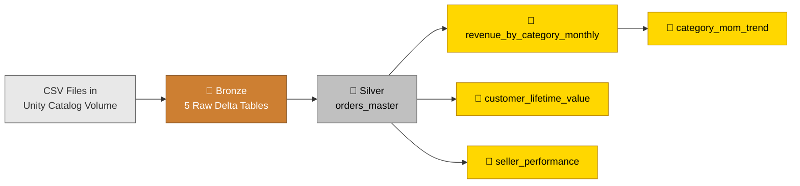
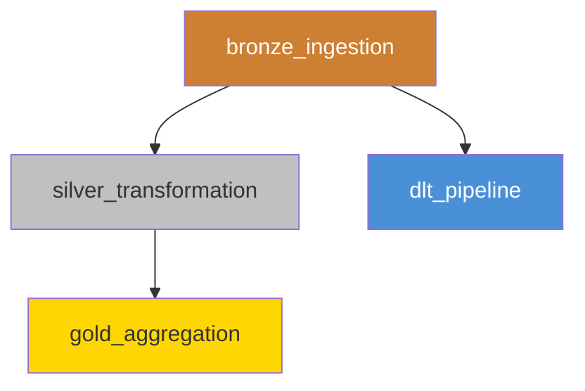

# Architecture Overview

## Data Flow



## Unity Catalog Namespace

```
brazilian-ecommerce (catalog)
├── bronze (schema)
│   ├── orders
│   ├── order_items
│   ├── customers
│   ├── products
│   └── payments
├── silver (schema)
│   └── orders_master
├── gold (schema)
│   ├── revenue_by_category_monthly
│   ├── customer_lifetime_value
│   ├── seller_performance
│   └── category_mom_trend
└── delta_demos (schema)
    ├── orders_incremental
    ├── customer_segments_scd2
    ├── schema_evolution_demo
    └── cdf_demo
```

## Workflow DAG



## CI/CD Flow


